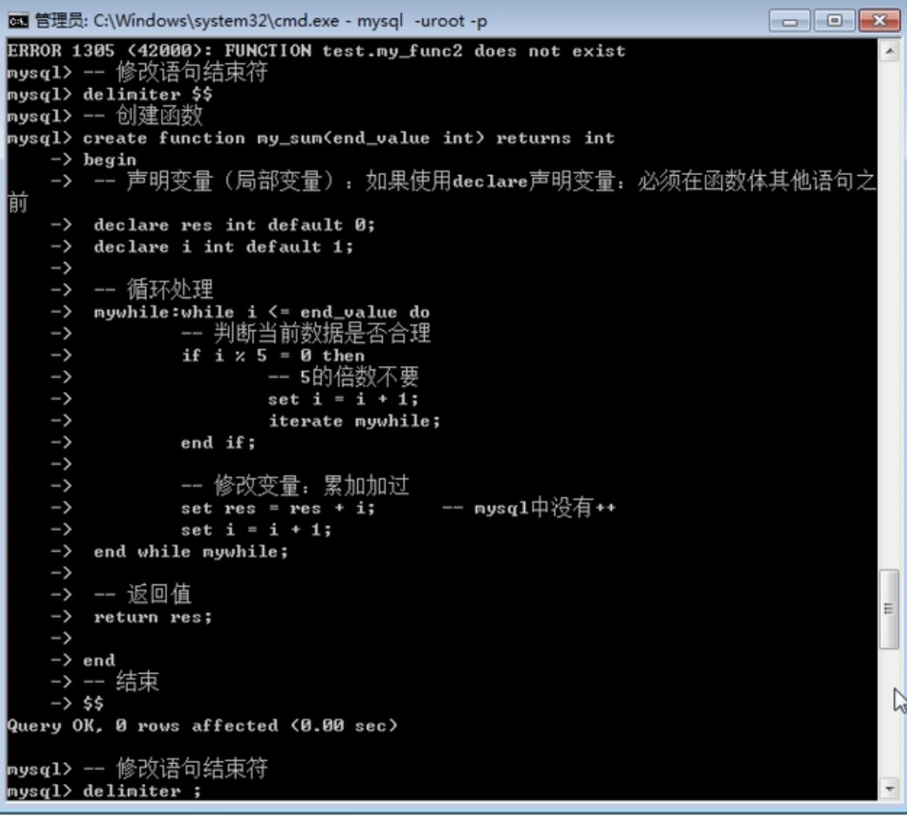

# 变量

Mysql本质是一种编程语言，需要很多变量来保存数据。Mysql中很多的属性控制都是通过mysql中固有的变量来实现的

### 系统变量

**系统内部定义的变量，系统变量针对所有用户（MySQL客户端）有效。**

**查看系统所有变量：show variables [like ‘pattern’];**

+ Mysql允许用户使用select查询变量的数据值（系统变量）

​        **基本语法：select @@变量名;**

+ 修改系统变量：

  1. 局部修改（会话级别）：只针对当前自己客户端当次连接有效

      **基本语法：set 变量名 = 新值;**

  2. 全局修改：针对所有的客户端，“所有时刻”都有效

     **基本语法：set global 变量名 = 值; 或者  set @@global.变量名 = 值；**

+ **全局修改之后**：所有连接的客户端并没发现改变？全局修改只针对新客户端生效（正在连着的无效）

  - **注意：如果想要本次连接对应的变量修改有效，那么不能使用全局修改，只能使用会话级别修改（set 变量名 = 值）;**

### 会话变量&局部变量

会话变量也称之为用户变量，会话变量跟mysql客户端是绑定的，设置的变量，只对当前用户使用的客户端生效。

<h4>会话变量</h4>

+ **定义用户变量：set @变量名 = 值;**
                             **set @变量名 := 值;**

```sql
set @text = 'Hello world';
set @text := 'Hello world';   -- 也可以

-- 在mysql中因为没有比较符号==，所以是用=代替比较符号：有时候在赋值的时候，会报错：mysql为了避免系统分不清是赋值还是比较：特定增加一个变量的赋值符号：  :=

```

+ Mysql是专门存储数据的：允许将数据从表中取出存储到变量中：**查询得到的数据必须只能是一行数据**（一个变量对应一个字段值）：Mysql没有数组。

  1. **赋值且查看赋值过程：**
     **select @变量1 := 字段1，@变量2 := 字段2 from 数据表 where 条件；**

     ```sql
     select @name := stu_name, @age := stu_age from stu where stu_id ='s05';
     ```

     - 错误语法：就是因为使用=，系统会当做比较符号来处理
       正确处理：使用:=

  2. **只赋值，不看过程：**
     **select 字段1，字段2… from 数据源 where条件 into @变量1，@变量2…**

  3. **查看变量：select @变量名;**


<h4>局部变量</h4>

作用范围在begin到end语句块之间。在该语句块里设置的变量，declare语句专门用于定义局部变量。

1.  局部变量是使用declare关键字声明
2. 局部变量declare语句出现的位置一定是在begin和end之间（beginend是在大型语句块中使用：函数/存储过程/触发器）
3. 声明语法：declare 变量名 数据类型 [属性];


# 流程结构

## If分支

If在Mysql中有两种**基本用法**

1. 用在select查询当中，当做一种条件来进行判断

   **基本语法：if(条件,为真结果,为假结果)**

```sql
select * , if(stu_age > 20 , 'OK' , 'NO') as judge from stu ;
```

2   **用在复杂的语句块中（函数/存储过程/触发器）**

```sql
if  条件表达式  then 
	满足条件要执行的语句;
End  if;
```

+ ### 复合语法

复合语法：代码的判断存在两面性，两面都有对应的代码执行。

```sql
If  条件表达式  then
	满足条件要执行的语句;
Else
	不满足条件要执行的语句;
-- 如果还有其他分支（细分），可以在里面再使用if
	If 条件表达式 then
		-- 满足要执行的语句
	End if;
End  if;
```


## While 循环

+ 基本语法

  - 循环体都是需要在大型代码块中使用

  - 基本语法

    ```sql
    While 条件 do
         要循环执行的代码;
    End while;
    ```

  

+ 结构标识符

  - 为某些特定的结构进行命名，然后为的是在某些地方使用名字
  - 基本语法

  ```sql
  标识名字:While 条件 do
  循环体
  End while [标识名字];
  
  -- 标识符的存在主要是为了循环体中使用循环控制。在mysql中没有continue和break，有自己的关键字替代：
  -- Iterate：迭代，就是以下的代码不执行，重新开始循环（continue）
  -- Leave：离开，整个循环终止（break）
  
  标识名字:While 条件 do
  	 If 条件判断 then
  		循环控制;
  		Iterate/leave 标识名字;
  	End if;
  循环体
  End while [标识名字];
  ```

# 函数  

  在mysql中，函数分为两类：系统函数（内置函数）和自定义函数

不管是内置函数还是用户自定义函数，都是使用select 函数名(参数列表);

### String函数

+ Char_length()：判断字符串的字符数
+ Length()：判断字符串的字节数（与字符集）
+ Concat()：连接字符串
+ Instr()：判断字符在目标字符串中是否存在，存在返回其位置，不存在返回0
  ```select instr('abcd','b'),instr('你好'','你')；```
+ Lcase()：全部小写
+ Left()：从左侧开始截取，直到指定位置（位置如果超过长度，截取所有）
+ Ltrim()：消除左边对应的空格
+ Mid()：从中间指定位置开始截取，如果不指定截取长度，直接到最后


### Time函数

+ Now()：返回当前时间，日期 时间

+ Curdate()：返回当前日期

+ Curtime()：返回当前时间

+ Datediff()：判断两个日期之间的天数差距，参数日期必须使用字符串格式（用引号）

+ Date_add(日期,interval 时间数字 type)：进行时间的增加

  ​                        Type:day/hour/minute/second

+ Unix_timestamp()：获取时间戳

+ From_unixtime()：将指定时间戳转换成对应的日期时间格式


### Math函数

+ Abs()：绝对值
+ Ceiling()：向上取整
+ Floor()：向下取整
+ Pow()：求指数，谁的多少次方
+ Rand()：获取一个随机数（0-1之间）
+ Round()：四舍五入函数


### 其他函数

+ Md5()：对数据进行md5加密（mysql中的md5与其他任何地方的md5加密出来的内容是完全相同的）
+ Version()：获取版本号
+ Databse()：显示当前所在数据库
+ UUID()：生成一个唯一标识符（自增长）：自增长是单表唯一，UUID是整库（数据唯一同时空间唯一）


## 自定义函数

自定义函数：用户自己定义的函数

函数：实现某种功能的语句块（由多条语句组成）

 

1. 函数内部的每条指令都是一个独立的个体：需要符合语句定义规范：需要语句结束符分号；

2. 函数是一个整体，而且函数是在调用的时候才会被执行，那么当设计函数的时候，意味着整体不能被中断；

3. Mysql一旦见到语句结束符分号，就会自动开始执行

 

解决方案：在定义函数之前，尝试修改临时的语句结束符

基本语法：delimiter

修改临时语句结束符：delimiter 新符号[可以使用系统非内置即可$$]

中间为正常SQL指令：使用分号结束（系统不会执行：不认识分号）

使用新符号结束

修改回语句结束符：delimiter ;   


#### 创建函数

自定义函数包含几个要素：function关键字，函数名，参数（形参和实参[可选]），确认函数返回值类型，函数体，返回值

 函数定义基本语法：

```sql
修改语句结束符
Create function 函数名(形参) returns 返回值类型
Begin
-- 函数体
Return 返回值数据;      -- 数据必须与结构中定义的返回值类型一致
End
语句结束符
修改语句结束符（改回来）

--datagrip中的话也可以不改语句结束符
```

+ 并不是所有的函数都需要begin和end：如果函数体本身只有一条指令（return），那么可以省略begin和end

+ **形参**：在mysql中需要为函数的形参指定数据类型（形参本身可以有多个）

  基本语法：变量名  

  ```sql
  -- 类似于C
  create function my_fun(num int , age int ) return  num+age;
  ```


####查看&调用&删除函数

1. 可以通过查看function状态，查看所有的函数

   **Show function status [like ‘pattern’];**

2. 查看函数的创建语句：show create function 函数名字;

3. 自定义函数的调用与内置函数的调用是一样的：
   select 函数名(实参列表)；

4. 删除函数：drop function 函数名;


#### 案例



```sql
select my_sum(100);
```


<h2>⚠️事项</h2>

+ 自定义函数是属于用户级别的：只有当前客户端对应的数据库中可以使用
+   可以在不同的数据库下看到对应的函数，但是不可以调用
+ 自定义函数：通常是为了将多行代码集合到一起解决一个重复性的问题
+ 函数因为必须规范返回值：那么在函数内部不能使用select指令：select一旦执行就会得到一个结果（result set）：select 字段 into @变量;（唯一可用）


# 变量作用域Scop

变量作用域：变量能够使用的区域范围

+ 局部作用域

  - 使用declare关键字声明（在结构体内：函数/存储过程/触发器），而且只能在结构体内部使用
  - declare关键字声明的变量没有任何符号修饰，就是普通字符串，如果在外部访问该变量，系统会自动认为是字段

+ 会话作用域

  - 用户定义的，使用@符号定义的变量，使用set关键字
  - 会话作用域：在当前用户当次连接有效，只要在本连接之中，任何地方都可以使用（可以在结构内部，也可以跨库）
  - 会话变量可以在函数内部使用

+ 全局作用域

  -  通常，在SQL编程的时候，不会使用自定义变量来控制全局。一般都是定义会话变量或者在结构中使用局部变量来解决问题。

  - 所有的客户端所有的连接都有效：需要使用全局符号来定义

    Set global 变量名 = 值;

    Set @@global.变量名 = 值;
    
#存储过程

​    存储过程（Stored Procedure）是在大型数据库系统中，一组为了完成特定功能的SQL 语句集，存储在数据库中，经过第一次编译后再次调用不需要再次编译（效率比较高），用户通过指定存储过程的名字并给出参数（如果该存储过程带有参数）来执行它。存储过程是数据库中的一个重要对象（针对SQL编程而言）。

 存储过程：简称过程

### 与函数的区别

+ 相同：
  - 存储过程和函数目的都是为了可重复地执行操作数据库的sql语句的集合。
  - 存储过程函数都是一次编译，后续执行
+ 不同点：
  - 标识符不同。函数的标识符为FUNCTION，过程为：PROCEDURE。
  - 函数中有返回值，且必须返回，而过程没有返回值。
  - 过程无返回值类型，不能将结果直接赋值给变量；函数有返回值类型，调用时，除在select中，必须将返回值赋给变量。
  - 函数可以在select语句中直接使用，而过程不能：函数是使用select调用，过程不是。


### 存储过程操作

```sql
---创建过程  基本语法

reate procedure 过程名字([参数列表])
Begin
	过程体
End
结束符

-- 如果过程体中只有一条指令，那么可以省略begin和end
```

```sql
-- 查看过程
show procedure status [like ‘pattern’];
show create procedure 过程名字;
```

```sql
-- 调用过程
-- 过程：没有返回值，select不可能调用
--调用过程有专门的语法：
call 过程名([实参列表]);
```

```sql
-- drop procedure
drop procedure 过程名字;
```


### 存储过程的形参类型

存储过程也允许提供参数（形参和实参）：存储的参数也和函数一样，需要指定其类型。

但是存储过程对参数还有额外的要求：自己的参数分类

+ In

表示参数从外部传入到里面使用（过程内部使用）：可以是直接数据也可以是保存数据的变量

+ Out

表示参数是从过程里面把数据保存到变量中，交给外部使用：传入的必须是变量

如果说传入的out变量本身在外部有数据，那么在进入过程之后，第一件事就是被清空，设为NULL

+ Inout

数据可以从外部传入到过程内部使用，同时内部操作之后，又会将数据返还给外部。

 

参数使用级别语法（形参）

过程类型  变量名  数据类型; //in int_1 int


# 触发器trigger

###  基本概念&作用

触发器是一种特殊类型的存储过程，它不同于我们前面介绍过的存储过程。触发器主要是通过事件进行触发而被执行的，而存储过程可以通过存储过程名字而被直接调用。

 触发器：trigger，是一种非常接近于js中的事件的知识。提前给某张表的所有记录（行）绑定一段代码，如果改行的操作满足条件（触发），这段提前准备好的代码就会自动执行。

<h3>作用</h3>

1、可在写入数据表前，强制检验或转换数据。（保证数据安全）

2、触发器发生错误时，异动的结果会被撤销。（如果触发器执行错误，那么前面用户已经执行成功的操作也会被撤销：事务安全）

3、部分数据库管理系统可以针对数据定义语言（DDL）使用触发器，称为DDL触发器。

4、可依照特定的情况，替换异动的指令 (INSTEAD OF)。（mysql不支持）

### 触发器优缺点

+ 优点

​         1、触发器可通过数据库中的相关表实现级联更改。（如果某张表的数据改变，可以利用触发器来实现其他表的无痕操作[用户不知道]）

​          2、保证数据安全：进行安全校验

+ 缺点
  - 对触发器过分的依赖，势必影响数据库的结构，同时增加了维护的复杂[程度](http://baike.baidu.com/view/644590.htm)。
  - 造成数据在程序层面不可控。（PHP层）

###基本语法

+ **创建触发器**

Create trigger 触发器名字 触发时机 触发事件 on 表 for each row

Begin

 End

 触发对象：on 表 for each row，触发器绑定实质是表中的所有行，因此当每一行发生指定的改变的时候，就会触发触发器。

+ **触发时机**

触发时机：每张表中对应的行都会有不同的状态，当SQL指令发生的时候，都会令行中数据发生改变，每一行总会有两种状态：数据操作前和操作后

 

Before：在表中数据发生改变前的状态

After：在表中数据已经发生改变后的状态

+ **触发事件**

触发事件：mysql中触发器针对的目标是数据发生改变，对应的操作只有写操作（增删改）

 

Insert：插入操作

Update：更新操作

Delete：删除操作

+ 注意事项

一张表中，每一个触发时机绑定的触发事件对应的触发器类型只能有一个：一张表中只能有一个对应after insert触发器

 

因此，一张表中最多的触发器只能有6个：before insert，before update，before delete，after insert，after update，after delete

+ **查看触发器**

1 查看全部触发器   Show triggers;

2 查看触发器的创建语句   Show create trigger 触发器名字;

+ **触发触发器**

想办法让触发器执行：让触发器指定的表中，对应的时机发生对应的操作即可。

1、表为my_orders

2、在插入之后

3、 插入操作

+ **删除触发器**

基本语法：drop trigger 触发器名字;


## 记录关键字：new、old

触发器针对的是数据表中的每条记录（每行），每行在数据操作前后都有一个对应的状态，触发器在执行之前就将对应的状态获取到了，将没有操作之前的状态（数据）都保存到old关键字中，而操作后的状态都放到new中。

 在触发器中，可以通过old和new来获取绑定表中对应的记录数据。

基本语法：关键字.字段名

 Old和new并不是所有触发器都有：

Insert：插入前全为空，没有old

Delete：清空数据，没有new

## 


 

 


​    

​    

​    

​    

​    


